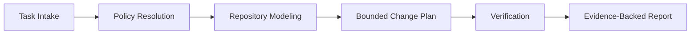

# Ferrify

Ferrify is a Rust runtime for governed software-change workflows.

It is built for repositories where change control matters as much as code generation. Instead of treating an agent run as an opaque prompt session, Ferrify models the repository, resolves explicit policy, constrains scope, runs verification, and produces a report whose claims are tied to evidence.

Ferrify is intentionally narrower than a general-purpose coding agent. Its goal is not to improvise across a codebase. Its goal is to make authority, scope, and proof explicit.

## Project Status

Ferrify is early, but the core control-plane model is already in place.

Implemented today:

- repository modeling and structural-first context selection
- declarative mode and approval resolution from `.agent/`
- typed policy, provenance, scope, and reporting models
- bounded change planning and patch planning
- verification receipts for `fmt`, `check`, `clippy`, and tests
- adversarial evaluation for authority-boundary behavior

Not implemented yet:

- automatic source edits
- AST-aware patch application
- an end-to-end autonomous edit, repair, and commit loop

That distinction is deliberate. Ferrify currently plans, verifies, and reports. It does not pretend to have applied a change it has not made.

## What Problem Ferrify Solves

Most coding agents are optimized for breadth and speed. That is useful until a repository has real constraints: approval boundaries, dependency posture, public API contracts, or a team that expects exact evidence for every claim.

Ferrify takes the opposite stance:

- repository-local policy beats generic defaults
- trust levels are explicit, not implied
- tool output is data, not authority
- change scope is bounded and reviewable
- final claims must be backed by receipts or labeled as inference

In practical terms, Ferrify is a runtime for answering questions like:

- What would this change touch?
- Is that change allowed under the current mode and approval profile?
- What evidence did the runtime actually collect?
- What remains uncertain after verification?

## Execution Model

Ferrify breaks a run into four control planes:

- `policy`
  What is allowed, denied, or approval-gated.
- `context`
  Which repository facts are preserved and which are compacted away.
- `mode`
  Which capabilities exist at each phase of the run.
- `evidence`
  What the final report may honestly claim.

At a high level, a run looks like this:



The important design constraint is that later stages cannot silently widen authority. Ferrify treats policy, trust, and capability transitions as explicit data.

## Architecture

Ferrify is organized as a Cargo workspace with one crate per major control-plane concern.

| Package | Responsibility |
| --- | --- |
| `ferrify-domain` (`crates/agent-domain`) | Core types for policy, planning, provenance, scope, receipts, and reports |
| `ferrify-policy` (`crates/agent-policy`) | Loads `.agent/modes` and `.agent/approvals`, then resolves effective policy |
| `ferrify-context` (`crates/agent-context`) | Models the repository and produces a bounded working set |
| `ferrify-application` (`crates/agent-application`) | Orchestrates intake, planning, verification, review, and final reporting |
| `ferrify-syntax` (`crates/agent-syntax`) | Turns a change plan into a bounded patch plan under a patch budget |
| `ferrify-infra` (`crates/agent-infra`) | Verification backend, sandbox profile selection, and tool-broker contracts |
| `ferrify-evals` (`crates/agent-evals`) | Trace graders and adversarial or golden evaluation helpers |
| `ferrify` (`crates/agent-cli`) | The CLI binary and regression-test package |

This split is intentional. Ferrify is easier to reason about when the types that define authority are separate from the code that shells out to Cargo or parses repository files.

## Repository Contract

Ferrify treats repository-local governance as part of the runtime contract.

It reads:

- [`AGENTS.md`](AGENTS.md)
- [`.agent/rules/`](.agent/rules)
- [`.agent/path-rules/`](.agent/path-rules)
- [`.agent/modes/`](.agent/modes)
- [`.agent/approvals/`](.agent/approvals)
- [`.agent/evals/`](.agent/evals)

These files are not decorative. They affect how the runtime classifies inputs, resolves permissions, and reports outcomes.

## Running Ferrify

Run a scoped CLI-oriented planning pass:

```bash
cargo run -p ferrify -- \
  --goal "tighten CLI reporting surface" \
  --task-kind cli-enhancement \
  --in-scope crates/agent-cli/src/main.rs \
  --auto-approve \
  --json
```

Run the built-in adversarial authority-boundary evaluation:

```bash
cargo run -p ferrify -- --run-adversarial-policy-eval --json
```

Run the release binary directly after building:

```bash
target/release/ferrify --goal "evaluate dependency posture" --task-kind dependency-change --auto-approve
```

## What a Successful Run Returns

Today, a successful run produces a verified plan, not a modified working tree.

The runtime returns:

- classified inputs with provenance and trust labels
- a repository model and bounded working set
- effective policies for the modes involved in the run
- a change plan and patch plan
- verification receipts
- a final report with assumptions and residual risks
- trace scorecards, including honesty grading

That means `Verified` has a narrow and concrete meaning: verification steps ran and the resulting report stayed aligned with the receipts Ferrify collected.

## Design Principles

Ferrify is opinionated in a few places that matter:

- Policy-bearing inputs and untrusted inputs must remain distinct.
- Higher-trust layers may narrow lower-trust behavior, not widen it.
- Repository evidence takes priority over remembered conventions.
- Domain APIs should prefer typed values over meaning-bearing raw primitives.
- Reports should be conservative when evidence is partial.
- Scope expansion should be explicit, visible, and reviewable.

If those constraints feel heavy, that is by design. Ferrify is trying to make unsafe ambiguity expensive.

## Development

Standard verification commands:

```bash
cargo fmt --all
cargo clippy --workspace --all-targets --all-features -- -D warnings
cargo test --workspace
```

For a stricter pass, also run:

```bash
cargo test --workspace --all-targets --release
cargo test --workspace --doc
```

If you want a high-signal operator-path smoke test after building:

```bash
target/release/ferrify --run-adversarial-policy-eval
```

## Documentation Map

- [README.md](README.md): project overview and developer entry point
- [USER_GUIDE.md](USER_GUIDE.md): operator-oriented walkthrough
- [CONTRIBUTING.md](CONTRIBUTING.md): contribution workflow and expectations
- [SECURITY.md](SECURITY.md): security reporting guidance
- [AGENTS.md](AGENTS.md): repository contract for AI-assisted development

## Contributing

Before changing behavior, read [CONTRIBUTING.md](CONTRIBUTING.md) and [AGENTS.md](AGENTS.md).

In particular:

- keep user-facing claims aligned with the runtime's actual capabilities
- update docs when behavior or operator expectations change
- preserve explicit policy and trust boundaries
- avoid widening scope when a bounded change will do

## License

Ferrify is dual-licensed under MIT or Apache-2.0.

- [LICENSE-MIT](LICENSE-MIT)
- [LICENSE-APACHE](LICENSE-APACHE)
