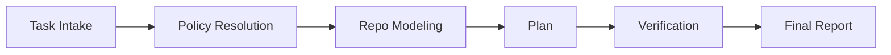

# Ferrify

Ferrify is a governed Rust software-change runtime for planning, policy enforcement, verification, and evidence-backed reporting.

It is designed for repos where "the agent suggested it" is not enough. Ferrify makes scope, approvals, and proof explicit.

## Current Status

Ferrify is early-stage and intentionally narrow.

What works today:

- repository modeling
- policy and approval resolution
- bounded change planning
- verification receipts
- final reporting with assumptions and residual risks

What does not exist yet:

- automatic source editing
- AST-level patch application
- a full autonomous edit-repair loop

## Why This Exists

Most coding agents optimize for speed and breadth. Ferrify optimizes for control:

- typed policy instead of prompt-only behavior
- repo-local rules instead of generic defaults
- explicit approval gates instead of silent privilege growth
- verification receipts instead of vague success language
- traceable reporting instead of hidden reasoning

If the repo is law, Ferrify is the runtime that tries to enforce it.

## Mental Model

Ferrify separates the run into distinct control planes:

- policy: what is allowed, denied, or approval-gated
- context: what repo facts are kept in working memory
- modes: which capabilities exist in each phase
- evidence: what claims the final report is allowed to make

At a high level, a run looks like this:



## Architecture

Ferrify is a Cargo workspace with a deliberately split control plane:

- `crates/agent-domain`
  Core types for policy, provenance, scope, plans, verification receipts, and reports.
- `crates/agent-policy`
  Loads mode specs and approval profiles, then resolves effective policy.
- `crates/agent-context`
  Scans the repo, builds a `RepoModel`, and selects a bounded working set.
- `crates/agent-application`
  Orchestrates intake, planning, verification, grading, and reporting.
- `crates/agent-syntax`
  Owns patch planning and edit-budget constraints.
- `crates/agent-infra`
  Provides verification runners, sandbox profile selection, and tool-broker types.
- `crates/agent-evals`
  Houses trace graders and adversarial/golden evaluation support.
- `crates/agent-cli`
  Exposes the `ferrify` binary.

## Repository Contract

Ferrify reads repo-local governance from:

- `AGENTS.md`
- `.agent/rules/`
- `.agent/path-rules/`
- `.agent/modes/`
- `.agent/approvals/`
- `.agent/evals/`

These files are treated as part of the runtime contract, not just documentation.

## Quick Start

Run Ferrify against the current workspace:

```bash
cargo run -p ferrify -- \
  --goal "tighten CLI reporting surface" \
  --task-kind cli-enhancement \
  --in-scope crates/agent-cli/src/main.rs \
  --auto-approve \
  --json
```

Run the built-in adversarial policy check:

```bash
cargo run -p ferrify -- --run-adversarial-policy-eval --json
```

## Example Workflow

For a normal run, Ferrify will:

1. classify trusted and untrusted inputs
2. model the workspace before planning
3. resolve mode and approval constraints
4. produce a bounded change plan
5. run verification steps
6. emit a final report tied to receipts

The important limitation is that the output is currently a verified plan, not an applied code change.

## Developer Workflow

Clone the repo and run the standard checks:

```bash
cargo fmt --all
cargo clippy --workspace --all-targets --all-features -- -D warnings
cargo test --workspace
```

If you want to inspect the CLI behavior directly:

```bash
target/debug/ferrify --run-adversarial-policy-eval --json
```

## Design Rules

Ferrify is opinionated about a few things:

- policy-bearing inputs must stay separate from untrusted text
- higher-trust layers may restrict lower layers, not widen them
- claims in reports should be backed by receipts or clearly marked as inference
- typed domain values are preferred over meaning-bearing raw primitives
- scope should stay narrow unless the task explicitly requires expansion

## Contributing

Start here:

- [CONTRIBUTING.md](CONTRIBUTING.md)
- [AGENTS.md](AGENTS.md)
- [USER_GUIDE.md](USER_GUIDE.md)
- [SECURITY.md](SECURITY.md)

If your change affects behavior or operator expectations, update the docs in the same PR.

## License

Ferrify is dual-licensed under MIT or Apache-2.0.
See [LICENSE-MIT](LICENSE-MIT) and [LICENSE-APACHE](LICENSE-APACHE).
